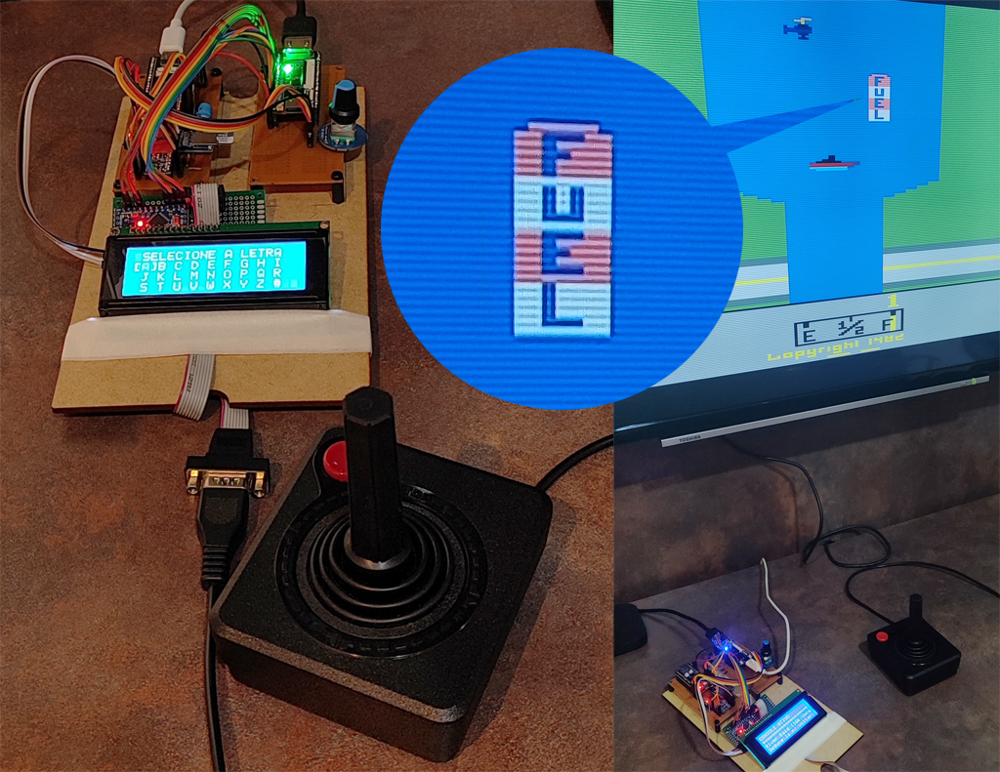
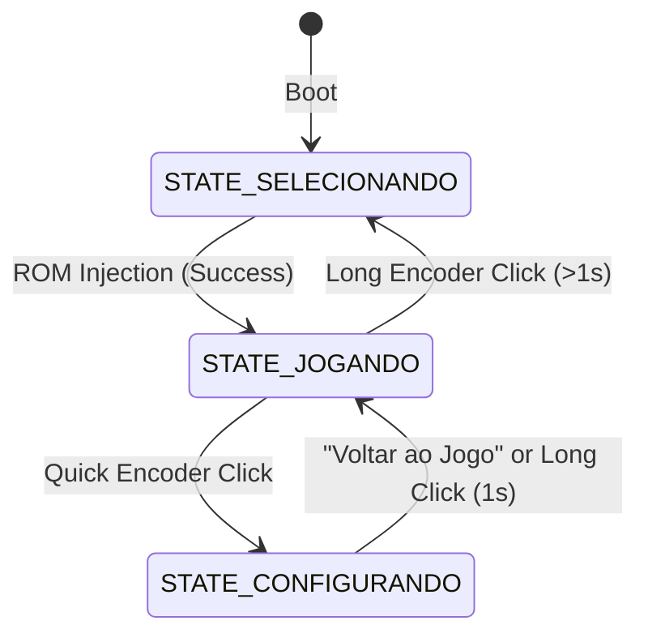

# FPGABuddy

🇺🇸 English | 🇧🇷 [Português](README.pt-BR.md)



## 1. System Overview
**FPGABuddy** is a firmware for the **Raspberry Pi Pico (RP2040)** microcontroller that acts as a companion (coprocessor) for an **Atari 2600** core running on a **Tang Nano 20k** FPGA.
* The RP2040 manages the SD card (FAT32), processes a local ROM database (`src/db.c`), renders the interface on an I2C 20x4 LCD display (`src/lcd_20x4.c`) and concurrently, in the selection and configuration states, on the **graphical on-screen-display (OSD) module inside the FPGA** ($128 \times 64$ pixels, 1-bit, via Target SPI `0x02`), and physically injects ROMs directly into the FPGA memory via the SPI0 bus.
* It also offers a **Quick Settings Menu** during gameplay to change FPGA parameters in real time.

---

## 2. Complete Pinout (RP2040)

The companion hardware uses the following RP2040 GPIOs:

| GP Pin | Function | Direction | Configuration / Note |
| :--- | :--- | :--- | :--- |
| **GP8** | RX (Cartridge) | Input | RX line (MOSI) of the reader (FPGABuddy Slave) |
| **GP9** | CS (Cartridge) | Input | Active-LOW Chip Select of the reader (FPGABuddy Slave) |
| **GP10** | SCK (Cartridge) | Input | Clock of the reader bus (FPGABuddy Slave) |
| **GP11** | TX (Cartridge) | Output | TX line (MISO) to the reader (FPGABuddy Slave) |
| **GP12** | Encoder VCC | Output | Kept at HIGH level (3.3V) |
| **GP13** | Encoder - Channel A | Input | Read by PIO0 SM1 |
| **GP14** | Encoder - Channel B | Input | Read by PIO0 SM1 |
| **GP15** | Encoder - Click (SW) | Input | Active LOW (internal pull-up enabled) |
| **GP16** | SPI0 MISO | Input | Shared between SD Card and FPGA |
| **GP17** | FPGA Chip Select (CS) | Output | Active LOW (manual control of the SPI bus) |
| **GP18** | SPI0 SCK | Output | Shared between SD Card and FPGA |
| **GP19** | SPI0 MOSI | Output | Shared between SD Card and FPGA |
| **GP20** | LCD I2C SDA | Bidirectional | Internal pull-ups enabled, i2c0 bus (operating at 100 kHz) |
| **GP21** | LCD I2C SCL | Bidirectional | Internal pull-ups enabled, i2c0 bus (operating at 100 kHz) |
| **GP22** | SD Chip Select (CS) | Output | Active LOW (managed by FatFS) |
| **GP3** | Auxiliary Button | Input | Decoupled from Encoder (configured with pull-down, sends F1 Select) |
| **GP25** | Onboard LED | Output | Blinks during boot / reflects encoder clicks |

---

## 3. SPI Communication Protocol (MCU $\rightarrow$ FPGA)

The SPI0 bus is operated in **Mode 1 (CPOL=0, CPHA=1)** at 20 MHz when communicating with the FPGA.
> [!IMPORTANT]
> **MISO Conflict Resolution**: After a change we made to the A2600Nano core, the FPGA keeps the MISO line in high impedance (`'Z'`) whenever the FPGA Chip Select (`GP17`) is inactive (`HIGH`). This allows the SD Card (`GP22`) to use the same bus without physical interference.

### Configuration Commands (SYS Target)
To change settings on the FPGA (such as scanlines or aspect ratio), the RP2040 sends synchronous **4-byte** packets:
```c
uint8_t cmd[4] = {
    0x00,       // Target 0 (SYS)
    0x04,       // CMD 4 (SETVAL)
    target_id,  // Parameter ID (ASCII)
    target_val  // Value (uint8_t)
};
```

#### Quick Settings Menu Structure (`menu_options`):
*   **Voltar ao Jogo (Back to Game)** (Index 0): Single-click action. Returns the system to the play state (`STATE_JOGANDO`) without modifying the FPGA.
*   **Reiniciar (Game Reset)** (Index 1): Single-click action. Simulates the physical Game Reset switch of the Atari console by transmitting keyboard key **F2** (`0x3B`) press and release events, returning the system immediately to the gameplay state.
*   **Scanlines (`'S'`)** (Index 2): `0` (Off), `1` (25%), `2` (50%), `3` (75%)
*   **De-comb (`'C'`)** (Index 3): `0` (No), `1` (Yes)
*   **Volume (`'A'`)** (Index 4): `0` (Mute), `1` (33%), `2` (66%), `3` (100%)
*   **Dificuldade P1 (`'X'`)** (Index 5): `0` (B - Easy), `1` (A - Hard)
*   **Dificuldade P2 (`'Y'`)** (Index 6): `0` (B - Easy), `1` (A - Hard)
*   **Ajuste Tela (`'W'`)** (Index 7): `0` (Normal 4:3), `1` (Wide 16:9) (Mapped as "Ajuste Tela" on the LCD)
*   **Swap Joysticks (`'&'`)** (Index 8): `0` (Normal), `1` (Swap P1/P2 ports)
*   **Padrao Video (`'E'`)** (Index 9): `0` (AUTO - reset on each new game), `1` (PAL), `2` (NTSC)
*   **VBlank (`'M'`)** (Index 10): `0` (No), `1` (Yes)
*   **Controles** (Index 11): `0` (JOY), `1` (PAD). Selecting `JOY` sends value `4` to Port 1 (ID `'Q'`) and value `5` to Port 2 (ID `'J'`). Selecting `PAD` sends value `9` to Port 1 (ID `'Q'`) and value `10` to Port 2 (ID `'J'`).

> [!NOTE]
> **SPI Mode Management for Settings**: To avoid synchronization conflicts with HID commands (which restore the bus to Mode 0 for SD Card compatibility), writing individual settings in the LCD menu uses the `fpga_send_config(id, val)` function. It temporarily switches SPI0 to **Mode 1** and restores it to **Mode 0** immediately after transmission.

### Additional Target SYS (0) and HID (1) Commands
*   **RGB LED Control (SYS Target, CMD 2)**:
    Sends **5-byte** packets to update the onboard WS2812 status LED of the FPGA:
    ```c
    uint8_t cmd[5] = {
        0x00, // Target 0 (SYS)
        0x02, // CMD 2 (SPI_SYS_RGB)
        r,    // Red (0-255, limited to 127 for LED preservation)
        g,    // Green (0-255, limited to 127)
        b     // Blue (0-255, limited to 127)
    };
    ```
*   **Keyboard Events (HID Target, CMD 1)**:
    Sends **3-byte** packets containing key press/release events to the core:
    ```c
    uint8_t cmd[3] = {
        0x01, // Target 1 (HID)
        0x01, // CMD 1 (SPI_HID_KEYBOARD)
        usb_kbd // Keyboard byte: bit 7 = 0 for Press, 1 for Release; bits 6-0 = USB HID Scan Code (e.g. F1 = 0x3a)
    };
    ```
*   **Mouse Events (HID Target, CMD 2)**:
    Sends **5-byte** packets containing button clicks and relative movement:
    ```c
    uint8_t cmd[5] = {
        0x01, // Target 1 (HID)
        0x02, // CMD 2 (SPI_HID_MOUSE)
        buttons, // Buttons byte: bit 0 = Left Click, bit 1 = Right Click (1 = pressed, 0 = released)
        dx,      // Relative X movement (int8_t)
        dy       // Relative Y movement (int8_t)
    };
    ```

### Target OSD (2) Commands
*   **Display Control (OSD Target, CMD 1)**:
    Sends **3-byte** packets to turn OSD visibility on/off:
    ```c
    uint8_t cmd[3] = {
        0x02, // Target 2 (OSD)
        0x01, // CMD 1 (Control)
        state // State: 0x01 to show, 0x00 to hide
    };
    ```
*   **Frame Buffer Write (OSD Target, CMD 2)**:
    Sends a $128 \times 64$ pixels bitmap image ($1024 \text{ bytes}$, 1 bit/pixel) to the internal OSD memory in the FPGA:
    ```c
    uint8_t cmd[3] = {
        0x02, // Target 2 (OSD)
        0x02, // CMD 2 (Write)
        0x00  // Initial column (0 to 127)
    };
    // Followed by a continuous stream of the 1024 bytes of image data in horizontal page-scan layout: { Page[2:0], Column[6:0] }
    ```

---

## 4. Firmware Structure (Modular Architecture)

The firmware was refactored in Phase 2 into a modular structure, logically divided into three main components:
1.  **`src/main.c`**: Contains `main()` and the global state machine, managing the main loop and event polling calls.
2.  **`src/ui_menu.c` / `src/ui_menu.h`**: Encapsulates menu options and strings, letter grid drawing routines, rendering of quick settings lines, and auxiliary LCD messages.
3.  **`src/fpga_ctrl.c` / `src/fpga_ctrl.h`**: Centralizes SPI logic, CS control, bus switching (SD vs. FPGA), ROM injection, RGB LED control, and sending HID keys.

The firmware life cycle is controlled by the following state machine:



### Details of the States and Fine-Tuning:
* **`STATE_SELECIONANDO`**:
  * The LCD renders a grid of letters for alphabetical search of ROMs, followed by the game list for the selected letter. Concurrently, the interface is drawn on the **FPGA graphical OSD** (vertically centered with a 2px spacing between lines).
  * The menu cursor preserves the position of the last loaded game upon returning.
  * The onboard RGB LED turns **Green** (`0, 127, 0`) to signal this state.
* **`STATE_JOGANDO`**:
  * The FPGA runs the game. The LCD displays the active game name and instructions to return. The **FPGA graphical OSD is automatically hidden** in this state.
  * The onboard RGB LED turns **Blue** (`0, 0, 127`) to signal the active console.
  * A long press on the encoder (1s) switches SPI back to the SD, remounts the FatFs partition, and returns to the game list **without resetting the FPGA** (gameplay remains active in the background). A complete reset and cartridge ejection only occur when injecting a new ROM.
* **`STATE_CONFIGURANDO` (Quick Settings Menu)**:
  * Entered via a quick click on the encoder during the game. The **FPGA graphical OSD becomes visible** on the TV/monitor screen concurrently to the I2C text LCD.
  * The onboard RGB LED turns **Red** (`127, 0, 0`).
  * A long press on the encoder (1s) switches SPI back to the SD, remounts the FatFs partition, and returns to the game list, just like in `STATE_JOGANDO`.
  * **Navigation Mode (`edit_mode = false`)**: Rotating the encoder moves the cursor `>` through the options.
  * **Edit Mode (`edit_mode = true`)**: Entered by clicking a parameter. The parameter value is enclosed in static brackets (e.g. `> Ajuste Tela:[16:9]`). **Value blinking is active** at a 250ms rate to indicate editing mode (made fluid due to the increased LCD frequency). Rotating the encoder changes the value immediately on the screen (both on the text LCD and the graphical OSD). Clicking again confirms and sends it via SPI to the FPGA.

---

## 5. Direct ROM Injection (SPI Loader) and DMA Handling

### A. Direct SPI Loader (FPGA in Slave Mode)
In the original core design (reference MiSTeryNano), the FPGA tried to assume control of the SPI bus as Master to read SD Card sectors using the local `sd_rw.v` module. Since our hardware uses a **single shared SPI0 bus** where the RP2040 is the absolute Master, this attempt at control generated electrical conflict and system lockup.

To solve this, we implemented the **`spi_loader_san.v`** module in the FPGA (acting exclusively as a Slave):
1. **Stream Start**: The RP2040 reads the ROM from the local SD into its buffer and pulls `CS_FPGA` LOW. It sends Target byte **`0x03` (SDC)** followed by command **`0x08` (`ROM_STREAM`)**.
2. **Reset and Mapping**: The FPGA intercepts the command, activates the `ioctl_download` signal (putting the Atari processor in Reset), and clears the address register `ioctl_addr`.
3. **Writing to RAM**: For each subsequent byte received, the FPGA generates a write pulse `ioctl_wr` and writes the data to the mapper RAM (`Gowin_SDPB`), incrementing `ioctl_addr`.
4. **Auto Boot**: When the RP2040 raises `CS_FPGA` HIGH, the FPGA ends the transaction, clears `ioctl_download` (taking the Atari out of Reset), and the game starts instantly from the loaded RAM.

### B. SPI Bus and DMA Management in the RP2040
To keep this flow stable without locking up the system:
1. **Bus Recovery**: We call `claim_spi_bus()` to reconfigure the SPI0 speed and mode to Mode 1 (`SPI_CPOL_0, SPI_CPHA_1`) required by the FPGA before transmitting data.
2. **Preventing DMA Exhaustion**: The SD Card driver (`no-OS-FatFS-SD-SDIO-SPI-RPi-Pico`) allocates RP2040 DMA channels upon each physical initialization. To prevent exhausting the chip's 12 DMA channels (which causes panic/system crashes due to lack of resources), we manually release the previous channels using `dma_channel_unclaim()` before re-initializing the SD Card when returning to the game menu.
3. **SPI Frequency & Auto-Recovery**: The SD Card is configured to run at **4 MHz** (rather than 8 MHz) in `src/hw_config.c` to improve signal integrity and robustness on prototype wiring. Additionally, `fpga_inject_rom()` implements an **auto-recovery mechanism**: if a file open/read operation fails due to transient bus issues or mechanical contact glitches during button clicks, it automatically resets the SPI bus, remounts the SD card, and retries the operation.

### C. Design Philosophy and Expandability (Physical Cartridge Board)
The FPGA core was simplified with the **complete exclusion** of complex internal modules that tried to mount the SD Card locally. This deliberate removal aims to keep the FPGA core as a pure slave to the companion.

This direct SPI injection architecture (`Target 3, CMD 8`) establishes the foundation for the development of another partner project: **the physical cartridge reader board**. 
* This reader board will extract data from Atari 2600 cartridges and communicate with the FPGABuddy (RP2040).
* The FPGABuddy will receive this cartridge data and use the same direct SPI protocol to inject the game into the FPGA RAM. This enables support for real cartridges in a clean and modular way.
* **Physical Interface and Roles**: For this dedicated communication between the cartridge reader (implemented with another RP2040) and the **FPGABuddy**, pins **GP8 to GP11** of the FPGABuddy (GP8 RX, GP9 CS, GP10 SCK, GP11 TX) have been reserved, with the latter acting as **Slave** on the bus.

---

## 6. Project Files

* `CMakeLists.txt`: Build script for the Pico SDK and companion sources.
* `src/main.c`: Main state machine and execution flow of the companion.
* `src/ui_menu.c` / `src/ui_menu.h`: Menu definitions and display routines for the LCD 20x4 and OSD.
* `src/font_5x8.h`: Bitmap 5x8 font table for ASCII rendering on the FPGA OSD.
* `src/fpga_ctrl.c` / `src/fpga_ctrl.h`: Control abstraction, ROM injection, RGB LED, HID writing, and OSD control.
* `src/encoder.c` / `src/encoder.pio`: High-fidelity rotary encoder reading via PIO state machine.
* `src/lcd_20x4.c`: I2C hardware control abstraction for the LCD 20x4 display.
* `src/db.c`: Local binary ROM database reading on the SD Card.
* `no-OS-FatFS-SD-SDIO-SPI-RPi-Pico/`: Integrated third-party library to read files from the SD Card.
* `resources/FPGA_adds_mods/ADD/spi_loader_san.v`: Custom Verilog module added to the FPGA to decode SPI loading commands and interface with the RAM (ioctl).
* `resources/FPGA_adds_mods/ADD/db9_to_spi_san.v`: SPI Master module for DB9-to-SPI gamepad adapter on Tang Nano 20k.
* `resources/FPGA_adds_mods/MOD/mcu_spi.v`: Modified SPI deserializer module on the FPGA with Tri-state output on the MISO line.
* `resources/FPGA_adds_mods/MOD/a2600_top_tn20k_san.vhd`: Main VHDL top module of the A2600Nano core modified to integrate the SPI loader and custom peripherals.

---

## 7. Key/Peripheral Emulation (GP3)
*   **F1 Select Key via GP3**: The auxiliary button on pin **GP3** is configured with an internal pull-down (active HIGH) and mapped to the **F1 Select** key (`0x3A`).
*   **Polling with Debounce**: Monitored continuously in `STATE_JOGANDO` with a **30ms** debounce time. On detecting a rising edge (Press), it sends the pressed key. On detecting a falling edge (Release), it sends the released key.

---

## 8. Compilation and Clean Rebuild

### Compile the firmware from the root directory:
```bash
cmake --build build
```

### Clear temporary files (Objects) from the previous build:
```bash
cmake --build build --target clean
```

### Perform a complete Clean Build with Ninja:
The Pico SDK on Windows has build instabilities in `bootstage2` when using the default Visual Studio generator (MSBuild). Therefore, it is highly recommended to force the **Ninja** generator:

```bash
# 1. On Windows (PowerShell/Cmd): delete the old build folder
rmdir /s /q build

# 2. Re-generate CMake settings forcing the Ninja generator
cmake -B build -G Ninja -DPICO_SDK_PATH="<path to pico-sdk>"

# 3. Build the project from scratch
cmake --build build
```

The resulting file ready to be flashed will be located at `build/fpgabuddy.uf2`.
