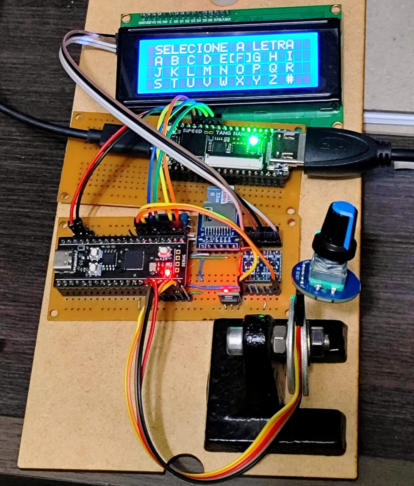
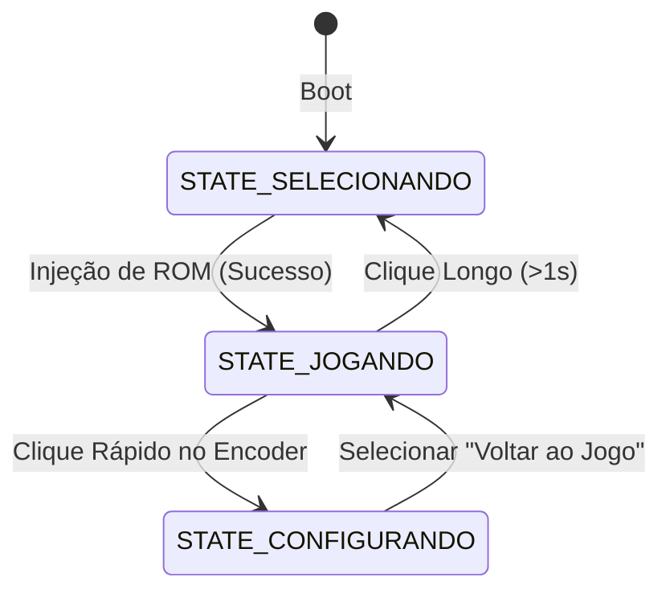

# FPGABuddy

🇺🇸 [English](README.md) | 🇧🇷 Português



## 1. Visão Geral do Sistema
O **FPGABuddy** é um firmware para o microcontrolador **Raspberry Pi Pico (RP2040)** que atua como companion (coprocessador) para um core de **Atari 2600** executado em uma FPGA **Tang Nano 20k**. 
* O RP2040 gerencia o cartão SD (FAT32), processa um banco de dados de ROMs local (`src/db.c`), renderiza a interface em um display LCD 20x4 I2C (`src/lcd_20x4.c`) e faz a injeção física das ROMs diretamente na memória da FPGA via barramento SPI0.
* Ele também oferece um **Menu de Configurações Rápidas** durante a gameplay para alterar parâmetros da FPGA em tempo real.

---

## 2. Pinagem Completa (RP2040)

O hardware do companion utiliza as seguintes GPIOs do RP2040:

| Pino GP | Função | Direção | Configuração / Nota |
| :--- | :--- | :--- | :--- |
| **GP8** | RX (Cartucho) | Entrada | Linha RX (MOSI) do leitor (FPGABuddy Slave) |
| **GP9** | CS (Cartucho) | Entrada | Chip Select ativo em LOW do leitor (FPGABuddy Slave) |
| **GP10** | SCK (Cartucho) | Entrada | Clock do barramento do leitor (FPGABuddy Slave) |
| **GP11** | TX (Cartucho) | Saída | Linha TX (MISO) para o leitor (FPGABuddy Slave) |
| **GP12** | VCC do Encoder | Saída | Mantido em nível HIGH (3.3V) |
| **GP13** | Encoder - Canal A | Entrada | Leitura por PIO0 SM1 |
| **GP14** | Encoder - Canal B | Entrada | Leitura por PIO0 SM1 |
| **GP15** | Encoder - Clique (SW) | Entrada | Ativo em LOW (Pull-up interno ativo) |
| **GP16** | SPI0 MISO | Entrada | Compartilhado entre SD Card e FPGA |
| **GP17** | FPGA Chip Select (CS) | Saída | Ativo em LOW (Controle manual do barramento SPI) |
| **GP18** | SPI0 SCK | Saída | Compartilhado entre SD Card e FPGA |
| **GP19** | SPI0 MOSI | Saída | Compartilhado entre SD Card e FPGA |
| **GP20** | LCD I2C SDA | Bidirecional| Pull-ups internos ativos, barramento `i2c0` (operando a 100 kHz) |
| **GP21** | LCD I2C SCL | Bidirecional| Pull-ups internos ativos, barramento `i2c0` (operando a 100 kHz) |
| **GP22** | SD Chip Select (CS) | Saída | Ativo em LOW (Gerenciado pelo FatFS) |
| **GP3** | Botão Auxiliar | Entrada | Desacoplado do Encoder (Configurado em Pull-down, envia F1 Select) |
| **GP25** | LED Onboard | Saída | Pisca durante o boot / reflete cliques do encoder |

---

## 3. Protocolo de Comunicação SPI (MCU $\rightarrow$ FPGA)

O barramento SPI0 é operado em **Modo 1 (CPOL=0, CPHA=1)** a 20 MHz ao falar com a FPGA.
> [!IMPORTANT]
> **Resolução de Conflito de MISO**: Após uma alteração que fizemos no core A2600Nano, a FPGA mantém a linha MISO em alta impedância (`'Z'`) sempre que o Chip Select da FPGA (`GP17`) estiver inativo (`HIGH`). Isso permite que o SD Card (`GP22`) use o mesmo barramento sem interferência física. 

### Comandos de Configuração (SYS Target)
Para alterar configurações na FPGA (como scanlines ou aspecto), o RP2040 envia pacotes síncronos de **4 bytes**:
```c
uint8_t cmd[4] = {
    0x00,       // Target 0 (SYS)
    0x04,       // CMD 4 (SETVAL)
    target_id,  // ID do parâmetro (ASCII)
    target_val  // Valor (uint8_t)
};
```

#### Estrutura do Menu de Configurações Rápidas (`menu_options`):
*   **Voltar ao Jogo** (Index 0): Ação de clique único. Retorna o sistema ao estado de jogo (`STATE_JOGANDO`) sem alterar a FPGA.
*   **Reiniciar** (Index 1): Ação de clique único. Envia o reset físico para a FPGA (ID `'R'` com `0x03` seguido de `0x00`) e retorna o sistema imediatamente ao jogo.
*   **Scanlines (`'S'`)** (Index 2): `0` (Desligado), `1` (25%), `2` (50%), `3` (75%)
*   **Volume (`'A'`)** (Index 3): `0` (Mudo), `1` (33%), `2` (66%), `3` (100%)
*   **Dificuldade P1 (`'X'`)** (Index 4): `0` (B - Fácil), `1` (A - Difícil)
*   **Dificuldade P2 (`'Y'`)** (Index 5): `0` (B - Fácil), `1` (A - Difícil)
*   **Ajuste Tela (`'W'`)** (Index 6): `0` (Normal 4:3), `1` (Wide 16:9) (Mapeado como "Ajuste Tela" no LCD)
*   **Swap Joysticks (`'&'`)** (Index 7): `0` (Normal), `1` (Trocar portas P1/P2)
*   **Padrão Vídeo (`'E'`)** (Index 8): `0` (AUTO - reiniciado a cada novo jogo), `1` (PAL), `2` (NTSC)
*   **De-comb (`'C'`)** (Index 9): `0` (Não), `1` (Sim)
*   **VBlank (`'M'`)** (Index 10): `0` (Não), `1` (Sim)

> [!NOTE]
> **Gerenciamento de Modo SPI para Configurações**: Para evitar conflitos de sincronismo com comandos HID (que restauram o barramento em Mode 0 para compatibilidade do SD Card), a escrita de configurações individuais no menu do LCD utiliza a função `fpga_send_config(id, val)`. Ela chaveia o SPI0 temporariamente para o **Modo 1** e restaura para o **Modo 0** imediatamente após a transmissão.

### Comandos Adicionais do Target SYS (0) e HID (1)
*   **Controle de LED RGB (SYS Target, CMD 2)**:
    Envia pacotes de **5 bytes** para atualizar o LED WS2812 onboard da FPGA:
    ```c
    uint8_t cmd[5] = {
        0x00, // Target 0 (SYS)
        0x02, // CMD 2 (SPI_SYS_RGB)
        r,    // Vermelho (0-255, limitado a 127 para preservação do LED)
        g,    // Verde (0-255, limitado a 127)
        b     // Azul (0-255, limitado a 127)
    };
    ```
*   **Eventos de Teclado (HID Target, CMD 1)**:
    Envia pacotes de **3 bytes** contendo eventos de pressionar/soltar teclas para o core:
    ```c
    uint8_t cmd[3] = {
        0x01, // Target 1 (HID)
        0x01, // CMD 1 (SPI_HID_KEYBOARD)
        usb_kbd // Byte do teclado: bit 7 = 0 para Press, 1 para Release; bits 6-0 = Scan Code USB HID (ex: F1 = 0x3a)
    };
    ```
*   **Eventos de Mouse (HID Target, CMD 2)**:
    Envia pacotes de **5 bytes** contendo o clique dos botões e deslocamento relativo:
    ```c
    uint8_t cmd[5] = {
        0x01, // Target 1 (HID)
        0x02, // CMD 2 (SPI_HID_MOUSE)
        buttons, // Byte dos botões: bit 0 = Clique Esquerdo, bit 1 = Clique Direito (1 = pressionado, 0 = solto)
        dx,      // Movimento X relativo (int8_t)
        dy       // Movimento Y relativo (int8_t)
    };
    ```

---

## 4. Estrutura do Firmware (Arquitetura Modular)

O firmware foi refatorado na Fase 2 para uma estrutura modular, dividida logicamente em três componentes principais:
1.  **`src/main.c`**: Contém o `main()` e a máquina de estados global, gerenciando o loop principal e chamadas de pooling de eventos.
2.  **`src/ui_menu.c` / `src/ui_menu.h`**: Encapsula as opções e strings do menu, as rotinas de desenho do grid de letras, renderização das linhas de configurações rápidas e mensagens auxiliares do LCD.
3.  **`src/fpga_ctrl.c` / `src/fpga_ctrl.h`**: Centraliza a lógica de SPI, controle de CS, comutação de barramento (SD vs. FPGA), injeção de ROM, controle do LED RGB e o envio de teclas HID.

O ciclo de vida do firmware é controlado pela seguinte máquina de estados:



### Detalhes dos Estados e Ajustes Finos:
* **`STATE_SELECIONANDO`**:
  * O LCD renderiza um grid de letras para busca alfabética de ROMs e, em seguida, a lista de jogos da letra selecionada.
  * O cursor do menu preserva a posição do último jogo carregado ao retornar.
  * O LED RGB onboard fica na cor **Verde** (`0, 127, 0`) para sinalizar este estado.
* **`STATE_JOGANDO`**:
  * A FPGA executa o jogo. O LCD exibe o nome do jogo ativo e a instrução de retorno.
  * O LED RGB onboard fica na cor **Azul** (`0, 0, 127`) para sinalizar o console ativo.
  * O clique longo do encoder (1s) comuta o SPI de volta para o SD, remonta a partição FatFs e retorna para a lista de jogos **sem resetar a FPGA** (a gameplay permanece ativa em background). O reset completo e ejeção de cartucho só ocorrem ao injetar uma nova ROM.
* **`STATE_CONFIGURANDO` (Menu de Configurações Rápidas)**:
  * Entra ao dar um clique rápido no encoder durante o jogo.
  * O LED RGB onboard fica na cor **Vermelho** (`127, 0, 0`).
  * O clique longo no encoder (1s) comuta o SPI de volta para o SD, remonta a partição FatFs e retorna para a lista de jogos, assim como no `STATE_JOGANDO`.
  * **Modo Navegação (`edit_mode = false`)**: Girar o encoder move o cursor `>` pelas opções.
  * **Modo Edição (`edit_mode = true`)**: Entra ao clicar em um parâmetro. O valor do parâmetro fica envolvido por colchetes estáticos (ex: `> Ajuste Tela:[16:9]`). **A piscagem (blink) do valor está ativa** a uma taxa de 250ms para indicar o modo de edição (tornada fluida devido ao aumento da frequência do LCD). Girar o encoder altera o valor imediatamente na tela. Clicar novamente confirma e envia via SPI para a FPGA.

---

## 5. Injeção Direta de ROM (Loader SPI) e Tratamento de DMA

### A. Loader SPI Direto (FPGA em Modo Slave)
No design original do core (MiSTeryNano de referência), a FPGA tentava assumir o barramento SPI como Master para ler setores do SD Card usando o módulo `sd_rw.v` local. Como nosso hardware usa um **único barramento SPI0 compartilhado** onde o RP2040 é o Master absoluto, essa tentativa de controle gerava conflito elétrico e travamento.

Para resolver isso, implementamos o módulo **`spi_loader_san.v`** na FPGA (atuando exclusivamente como Slave):
1. **Início do Stream**: O RP2040 lê a ROM do SD local para seu buffer e puxa `CS_FPGA` para `LOW`. Envia o byte **Target `0x03` (SDC)** seguido do comando **`0x08` (`ROM_STREAM`)**.
2. **Reset e Mapeamento**: A FPGA intercepta o comando, ativa o sinal `ioctl_download` (colocando o processador Atari em Reset) e zera o registrador de endereço `ioctl_addr`.
3. **Escrita na RAM**: Para cada byte subsequente recebido, a FPGA gera um pulso de escrita `ioctl_wr` e grava o dado na RAM de mappers (`Gowin_SDPB`), incrementando `ioctl_addr`.
4. **Boot automático**: Quando o RP2040 levanta `CS_FPGA` para `HIGH`, a FPGA encerra a transação, limpa `ioctl_download` (tirando o Atari do Reset), e o jogo inicializa instantaneamente da RAM gravada.

### B. Gerenciamento do Barramento SPI e DMA no RP2040
Para manter esse fluxo estável sem travar o sistema:
1. **Recuperação do Barramento**: Chamamos `claim_spi_bus()` para reconfigurar a velocidade e o modo do SPI0 para o Modo 1 (`SPI_CPOL_0, SPI_CPHA_1`) exigido pela FPGA antes de transmitir os dados.
2. **Prevenção de Esgotamento de DMA**: O driver do SD Card (`no-OS-FatFS-SD-SDIO-SPI-RPi-Pico`) aloca canais de DMA do RP2040 a cada inicialização física. Para evitar que os 12 canais de DMA do chip se esgotem (causando panic/travamento do sistema por falta de recursos), liberamos manualmente os canais anteriores usando `dma_channel_unclaim()` antes de re-inicializar o SD Card ao retornar ao menu de jogos.
3. **Frequência do SPI e Auto-Recuperação**: O SD Card está configurado para operar a **4 MHz** (em vez de 8 MHz) em `src/hw_config.c` para aumentar a tolerância a ruído de sinal em fiações de protótipo. Adicionalmente, a função `fpga_inject_rom()` implementa um **mecanismo de auto-recuperação (retry)**: caso uma operação de abertura/leitura de arquivo falhe devido a oscilações mecânicas no clique do botão ou instabilidades temporárias no barramento, o sistema reinicializa o barramento SPI, remonta a partição do SD e tenta novamente a leitura.

### C. Filosofia de Design e Expansibilidade (Placa de Cartucho Físico)
O core da FPGA foi simplificado com a **exclusão total** de módulos internos complexos que tentavam fazer a montagem do SD Card localmente. Essa remoção deliberada visa manter o core da FPGA como um escravo puro do companion.

Essa arquitetura de injeção direta via SPI (`Target 3, CMD 8`) estabelece a base para o desenvolvimento de outro projeto parceiro: **a placa leitora de cartuchos físicos**. 
* Essa placa leitora extrairá os dados dos cartuchos de Atari 2600 e se comunicará com o **FPGABuddy** (RP2040).
* O **FPGABuddy** receberá esses dados do cartucho e usará o mesmo protocolo SPI direto para injetar o jogo na RAM da FPGA. Isso viabiliza o suporte a cartuchos reais de forma modular e limpa.
* **Interface Física e Papéis**: Para esta comunicação dedicada entre o leitor de cartuchos (implementado com outro RP2040) e o **FPGABuddy**, foram reservados os pinos **GP8 a GP11** do FPGABuddy (GP8 RX, GP9 CS, GP10 SCK, GP11 TX), com este atuando como **Slave** no barramento.

---

## 6. Arquivos do Projeto

* `CMakeLists.txt`: Script de compilação do Pico SDK e sources do companion.
* `src/main.c`: Máquina de estados principal e fluxo de execução do companion.
* `src/ui_menu.c` / `src/ui_menu.h`: Definição de menus e rotinas do display LCD 20x4.
* `src/fpga_ctrl.c` / `src/fpga_ctrl.h`: Abstração de controle, injeção de ROM, LED RGB e escrita HID.
* `src/encoder.c` / `src/encoder.pio`: Leitura de alta fidelidade do encoder rotativo via máquina de estados PIO.
* `src/lcd_20x4.c`: Abstração de controle de hardware I2C do display LCD 20x4.
* `src/db.c`: Leitura do banco de dados binário de jogos no cartão SD.
* `no-OS-FatFS-SD-SDIO-SPI-RPi-Pico/`: Biblioteca de terceiros integrada para ler arquivos do cartão SD.
* `resources/FPGA_adds_mods/ADD/spi_loader_san.v`: O módulo Verilog customizado adicionado à FPGA para decodificar os comandos SPI de carregamento e interfacear com a RAM (ioctl).
* `resources/FPGA_adds_mods/MOD/mcu_spi.v`: Módulo deserializador SPI na FPGA modificado com saída Tri-state na linha MISO.

---

## 7. Emulação de Teclas/Periféricos (GP3)
*   **Tecla F1 Select via GP3**: O botão auxiliar no pino **GP3** está configurado com pull-down interno (ativo em `HIGH`) e mapeado para a tecla **F1 Select** (`0x3A`).
*   **Polling com Debounce**: É monitorado continuamente em `STATE_JOGANDO` com um tempo de debounce de **30ms**. Ao detectar uma borda de subida (Press), envia a tecla pressionada. Ao detectar uma borda de descida (Release), envia a tecla solta.

---

## 8. Compilação e Recompilação Limpa

### Compilar o firmware a partir do diretório raiz:
```bash
cmake --build build
```

### Limpar arquivos temporários (Objetos) do build anterior:
```bash
cmake --build build --target clean
```

### Realizar uma reconstrução limpa completa (Clean Build) com Ninja:
O Pico SDK no Windows apresenta instabilidades de build no `bootstage2` ao utilizar o gerador padrão do Visual Studio (MSBuild). Por isso, recomenda-se fortemente forçar o gerador **Ninja**:

```bash
# 1. No Windows (PowerShell/Cmd): apaga a pasta de build antiga
rmdir /s /q build

# 2. Regenera as configurações do CMake forçando o gerador Ninja
cmake -B build -G Ninja -DPICO_SDK_PATH="<caminho para o pico-sdk>"

# 3. Compila o projeto do zero
cmake --build build
```

O arquivo resultante pronto para gravação estará localizado em `build/fpgabuddy.uf2`.
