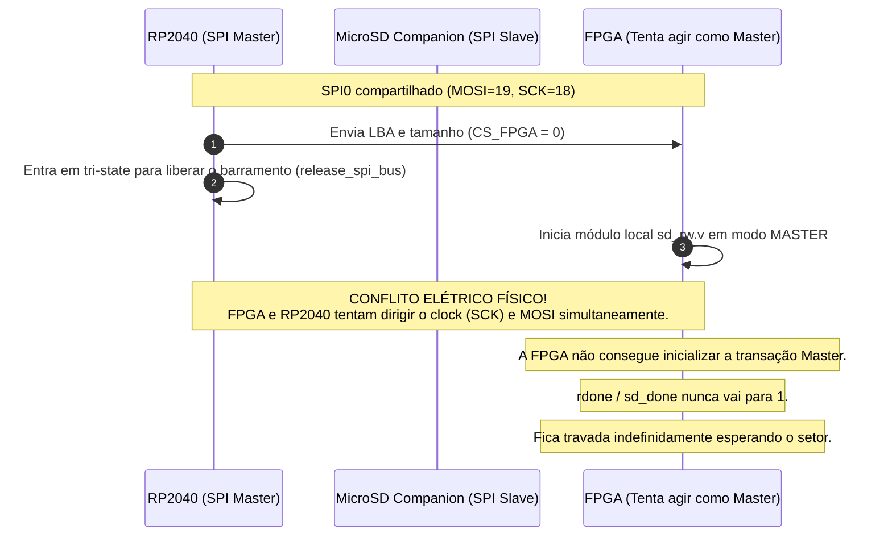
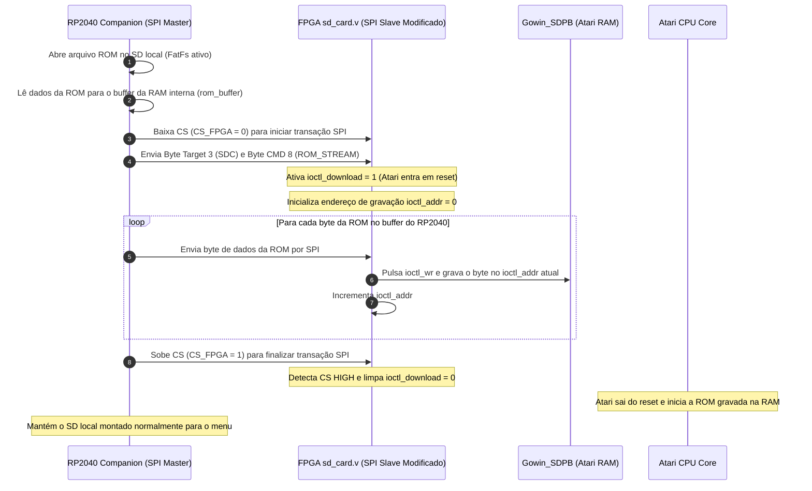

# Arquitetura de Comunicação e Ingestão de ROM: RP2040 Companion & FPGA

Este documento descreve as especificações de comunicação SPI e o fluxo de carregamento de jogos (ROMs) entre o microcontrolador RP2040 (Companion) e a FPGA Tang Nano 20K (Core Atari 2600), detalhando o comportamento do modelo original, a colisão de barramento no hardware customizado e as diretrizes para a nova implementação de injeção direta.

---

## 1. Contexto de Hardware e Topologia do Barramento SPI

Existe uma diferença crucial de barramentos entre a placa de referência original e o hardware customizado atual:

### A. Topologia Original (MiSTeryNano / Tang Nano + BL616)
O microcontrolador interno BL616 trabalha com **dois barramentos SPI independentes**:
1.  **Barramento SPI 1 (Controle)**: Conexão direta e exclusiva entre o MCU (Master) e a FPGA (Slave) para comandos de sistema, joystick e OSD.
2.  **Barramento SPI 2 (Compartilhado do SD)**: Linhas físicas do slot microSD na Tang Nano 20K. Tanto o MCU quanto a FPGA estão conectados a este barramento físico e alternam o papel de Master (usando tri-state e controle cooperativo) para acessar o cartão SD.

### B. Topologia Customizada (Nosso Hardware)
Utiliza um **único barramento SPI0 compartilhado** no RP2040 (`MOSI=GP19`, `MISO=GP16`, `SCK=GP18`):
*   **RP2040**: É o **Master absoluto e exclusivo** deste barramento físico.
*   **MicroSD do Companion**: Conectado ao mesmo barramento físico SPI0 como **Slave** (Chip Select = `GP22`).
*   **FPGA**: Conectada ao mesmo barramento físico SPI0 como **Slave** (Chip Select = `GP17`).

---

## 2. O Ponto de Falha no Hardware Customizado (Colisão Elétrica e Travamento)

No firmware original da FPGA, ao receber a sinalização de montagem da ROM, ela tenta assumir o barramento físico do SD em modo Master para ler os setores físicos da ROM via `sd_card.v` / `sd_rw.v`.

No hardware customizado, isso resulta em um **conflito elétrico e travamento**:

*   **Conclusão**: A FPGA, sendo fisicamente uma escrava no barramento SPI0 compartilhado com o RP2040, não pode atuar como Master para ler o microSD.

---

## 3. Fluxo de Carregamento Proposto (Direct SPI ROM Injection)

Para contornar a limitação e simplificar a arquitetura, o companion (RP2040) passará a ler a ROM de seu próprio SD e a transmitirá diretamente via SPI para a RAM de mappers da FPGA. O módulo `loader_sd_card.sv` e o leitor físico `sd_rw.v` da FPGA serão ignorados no carregamento de ROM.

### Passo a Passo da Nova Implementação:

### Protocolo de Transmissão por SPI (CMD 8):
*   **Frame SPI**: Framed por `CS_FPGA = 0`.
*   **Byte 0**: `0x03` (Target SDC).
*   **Byte 1**: `0x08` (CMD ROM_STREAM).
*   **Bytes 2 a N**: Dados sequenciais do arquivo `.bin` (ROM).
*   **Fim do Frame**: Levantamento de `CS_FPGA = 1`.

---

## 4. Vantagens Adicionais da Nova Abordagem

1.  **Estabilidade de Software no RP2040**: Não há necessidade de chavear pinos SPI em alta impedância nem remontar o sistema de arquivos a cada seleção de jogo, prevenindo corrupção de FATFS e problemas de inicialização do SD Card.
2.  **Velocidade**: A transmissão direta por SPI a 5 MHz transfere uma ROM típica de 16KB-32KB em menos de 100 milissegundos.
3.  **Preparação para Cartuchos Reais**: Estabelece o padrão de gravação direta na RAM do emulador de mappers, que é o mesmo princípio necessário para gerenciar cartuchos físicos no futuro.
